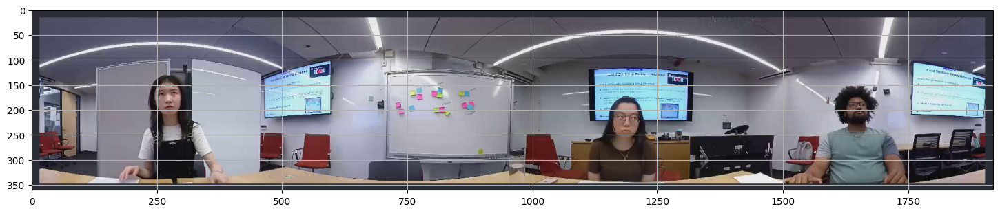

# video360-agent
# 360 Video Participant Auto-Cropping Demo

This project demonstrates an automatic pipeline to detect participants in a 360° meeting video and generate stabilized per-person crops.

## Features

- Detects people using YOLOv8
- Automatically estimates stable bounding boxes
- Crops each participant into a fixed portrait view
- Supports missing participants (empty slots)
- Outputs individual videos per participant

## Pipeline

1. Sample frames from a 360 panorama video
2. Detect persons using YOLOv8
3. Assign detections to spatial slots
4. Estimate stable bounding boxes via median aggregation
5. Generate crop windows
6. Export cropped participant videos

## Example Input

360° stitched meeting video.

## Example Detection

Below shows the automatically detected participant regions from the 360 video.

## Example Output

- `person_slot0_640x900.mp4`
- `person_slot2_640x900.mp4`
- `person_slot3_640x900.mp4`

## Requirements
